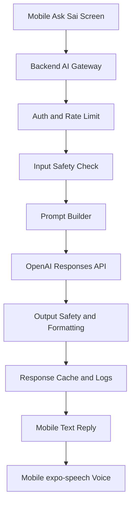
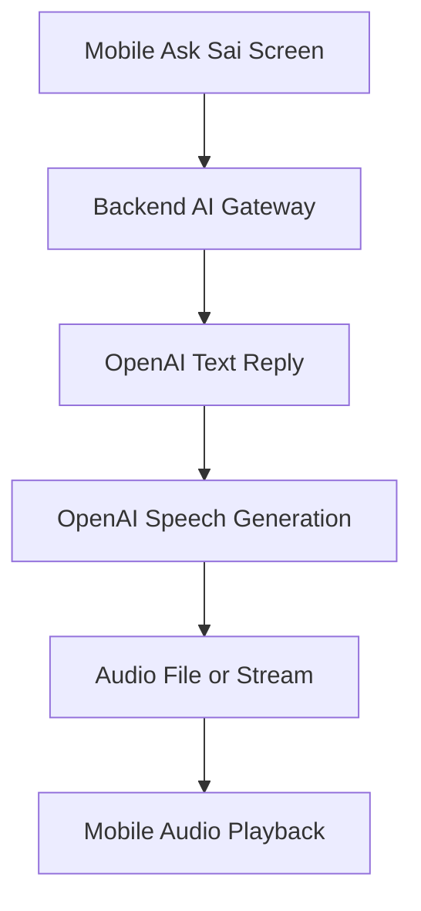

# Devotee AI Assistant Backend Requirements

This document defines the backend APIs needed for the Sai Family mobile app AI assistant.

Feature goal:

- Devotee asks a question in the Experiences pillar.
- AI responds quickly in written text.
- App can speak the answer in voice.
- Backend owns OpenAI integration securely.
- Mobile app never stores or sends an OpenAI API key directly.

Current frontend files:

- `app/(tabs)/experiences/ask-sai.tsx`
- `services/devotee-ai.ts`
- `docs/openai-devotee-assistant-backend-contract.md`

Official OpenAI references reviewed:

- Streaming responses: https://developers.openai.com/api/docs/guides/streaming-responses
- Text to speech: https://developers.openai.com/api/docs/guides/text-to-speech
- Speech to text: https://developers.openai.com/api/docs/guides/speech-to-text
- Safety best practices: https://developers.openai.com/api/docs/guides/safety-best-practices

## Product Principle

This is not a generic chatbot.

It should feel like a calm Sai Family guide:

- short
- respectful
- practical
- spiritually supportive
- easy to understand for 40+ age users
- never overconfident on medical, legal, financial, or emergency topics

The assistant must not claim to be Sai Baba.

Preferred wording:

- "Sai assistant says..."
- "A gentle way to think about this is..."
- "For this matter, please also speak with..."

Avoid:

- "I am Sai Baba"
- "Sai Baba guarantees..."
- "This will surely cure..."
- "You must..."

## High-Level Architecture



Optional voice upgrade:



## Recommended Rollout

### Phase 1: Fast Text API

Use normal JSON request/response.

Reason:

- simplest
- stable
- works with current frontend
- easiest to secure and rate limit
- voice already works on device through `expo-speech`

### Phase 2: Streaming Text API

Add streaming so the user sees the first words quickly.

Reason:

- perceived speed is much better
- mobile screen feels alive
- useful for slower network or longer answers

### Phase 3: Backend Voice API

Add OpenAI text-to-speech only if device voice quality is not enough.

Reason:

- backend voice costs more
- audio files need caching/expiry/storage
- first text response should still arrive before audio generation completes

## API 1: Ask Devotee Question

Required for current mobile app.

```http
POST /api/ai/devotee-question
```

### Headers

```http
Authorization: Bearer <accessToken>
x-user-id: <userId>
Content-Type: application/json
```

### Request

```json
{
  "question": "How can I keep faith during a difficult time?",
  "pillar": "experiences",
  "conversationId": "optional-existing-conversation-id",
  "locale": "en-IN",
  "voice": false
}
```

### Validation

| Field | Required | Rule |
| --- | --- | --- |
| `question` | yes | string, min 3, max 1000 |
| `pillar` | no | `experiences`, `events`, `directory`, `sangha` |
| `conversationId` | no | string UUID/cuid |
| `locale` | no | default `en-IN` |
| `voice` | no | boolean |

### Success Response

```json
{
  "answer": "Keep one small daily practice. Sit quietly, remember Sai, and take the next right step with patience.",
  "conversationId": "cm-ai-conv-123",
  "messageId": "cm-ai-msg-456",
  "safetyNote": "For medical, legal, financial, or emergency matters, please contact a qualified professional.",
  "model": "gpt-4.1-mini",
  "latencyMs": 840,
  "cached": false
}
```

### Frontend Compatibility

Current app accepts any one of:

- `answer`
- `reply`
- `text`
- `message`

Backend should return `answer`.

## API 2: Streaming Devotee Question

Recommended for fast perceived response.

```http
POST /api/ai/devotee-question/stream
```

Recommended transport:

- Server-Sent Events for text streaming
- WebSocket only if we later add true live voice conversation

### Request

Same as `POST /api/ai/devotee-question`.

### SSE Events

```text
event: start
data: {"conversationId":"cm-ai-conv-123","messageId":"cm-ai-msg-456"}

event: delta
data: {"text":"Keep one small"}

event: delta
data: {"text":" daily practice."}

event: complete
data: {"answer":"Keep one small daily practice.","latencyMs":620,"cached":false}
```

### Error Event

```text
event: error
data: {"code":"AI_PROVIDER_ERROR","message":"Unable to answer right now."}
```

### Performance Target

- time to first token: under 800 ms when OpenAI and network are healthy
- full short answer: under 2.5 seconds
- backend timeout: 12 seconds
- mobile timeout: 15 seconds

## API 3: Generate Voice For Answer

Optional Phase 3.

Use this only if we want higher-quality voice than device `expo-speech`.

```http
POST /api/ai/devotee-question/:messageId/speech
```

### Request

```json
{
  "voice": "alloy",
  "format": "mp3",
  "locale": "en-IN"
}
```

### Success Response

Option A: return a signed audio URL.

```json
{
  "audioUrl": "https://storage.example.com/ai/audio/cm-ai-msg-456.mp3?sig=...",
  "expiresAt": "2026-07-09T12:30:00.000Z",
  "durationMs": 8200
}
```

Option B: stream audio bytes.

```http
Content-Type: audio/mpeg
Cache-Control: private, max-age=3600
```

Recommendation:

- Start with signed audio URL.
- Cache audio per `messageId + voice + format`.
- Expire URL after 1 hour.
- Store generated audio for 7 days max unless product requires history.

## API 4: Voice Question Transcription

Optional if user asks question by speaking.

```http
POST /api/ai/devotee-question/transcribe
```

### Request

`multipart/form-data`

| Field | Required | Rule |
| --- | --- | --- |
| `audio` | yes | m4a/mp3/wav/webm, max 20 MB |
| `locale` | no | default `en-IN` |

### Success Response

```json
{
  "text": "How can I keep faith during a difficult time?",
  "language": "en",
  "durationMs": 5200
}
```

## API 5: Conversation History

Optional, but recommended for continuity.

```http
GET /api/ai/devotee-conversations?limit=20&offset=0
```

```http
GET /api/ai/devotee-conversations/:conversationId
```

```http
DELETE /api/ai/devotee-conversations/:conversationId
```

### Conversation List Response

```json
{
  "items": [
    {
      "id": "cm-ai-conv-123",
      "title": "Keeping faith during difficult time",
      "lastMessageAt": "2026-07-09T10:30:00.000Z",
      "messageCount": 4
    }
  ],
  "pagination": {
    "limit": 20,
    "offset": 0,
    "total": 1,
    "hasMore": false
  }
}
```

## Required Backend Services

Recommended architecture:

```text
Controller -> Service -> Repository -> Provider Client
```

Files:

```text
src/modules/ai/
  ai.controller.ts
  ai.service.ts
  ai.repository.ts
  ai.routes.ts
  ai.validation.ts
  ai.prompt.ts
  ai.safety.ts
  ai.cache.ts
  openai.client.ts
```

## Database Tables

### `ai_conversations`

| Column | Type | Notes |
| --- | --- | --- |
| `id` | string | cuid/uuid |
| `userId` | string | FK user/account |
| `title` | string | generated from first question |
| `pillar` | string | source pillar |
| `createdAt` | datetime | indexed |
| `updatedAt` | datetime | indexed |
| `deletedAt` | datetime nullable | soft delete |

### `ai_messages`

| Column | Type | Notes |
| --- | --- | --- |
| `id` | string | cuid/uuid |
| `conversationId` | string | FK |
| `userId` | string | FK |
| `role` | string | `user` or `assistant` |
| `content` | text | encrypted if policy requires |
| `model` | string nullable | assistant messages |
| `latencyMs` | int nullable | assistant messages |
| `promptTokens` | int nullable | usage |
| `completionTokens` | int nullable | usage |
| `cached` | boolean | default false |
| `safetyStatus` | string | `allowed`, `blocked`, `redirected` |
| `createdAt` | datetime | indexed |

### `ai_feedback`

| Column | Type | Notes |
| --- | --- | --- |
| `id` | string | cuid/uuid |
| `messageId` | string | FK |
| `userId` | string | FK |
| `rating` | string | `helpful`, `not_helpful` |
| `reason` | string nullable | optional |
| `createdAt` | datetime | indexed |

## Prompt Requirements

System prompt should enforce:

- You are Sai Family's devotee assistant.
- You are not Sai Baba.
- Give gentle spiritual reflection and practical next steps.
- Keep answer under 120 words by default.
- Use simple language for 40+ users.
- If user asks medical/legal/financial/emergency advice, provide a supportive disclaimer and advise contacting a qualified professional.
- If user asks about app data, use backend tools/data only; do not invent.
- If uncertain, say so.

Example answer style:

```text
A gentle way to begin is with one small prayer each morning. Sit quietly for two minutes, remember Sai, and choose one kind action for the day. Faith often grows through small steady practice, not pressure.
```

## Fast Response Strategy

Backend should optimize for perceived speed:

1. Validate request locally.
2. Check cache for common generic questions.
3. Start OpenAI request quickly.
4. Use a low-latency model for normal questions.
5. Keep output short by default.
6. Use streaming endpoint for better perceived speed.
7. Generate audio only after text is ready.
8. Do not block text response on audio generation.

Recommended model strategy:

| Use case | Model class |
| --- | --- |
| normal spiritual/app guidance | fast mini text model |
| complex emotional/supportive question | stronger text model |
| speech generation | OpenAI speech model |
| speech transcription | OpenAI transcription model |

Backend should keep model names in env/config, not mobile app.

```bash
OPENAI_API_KEY=
AI_TEXT_MODEL=
AI_COMPLEX_TEXT_MODEL=
AI_TTS_MODEL=
AI_TRANSCRIPTION_MODEL=
AI_REQUEST_TIMEOUT_MS=12000
AI_MAX_OUTPUT_TOKENS=350
```

## Caching

Cache only safe generic answers.

Cache examples:

- "What is a simple Sai prayer?"
- "How do I post an experience?"
- "How do I RSVP for an event?"

Do not cache:

- personal health questions
- legal/financial questions
- deeply personal emotional details
- user-specific app data

Cache key:

```text
sha256(normalizedQuestion + locale + pillar + promptVersion)
```

Recommended TTL:

- generic spiritual/app FAQ: 7 days
- dynamic app data: no cache or 5 minutes max

## Rate Limiting

Required:

- per user: 20 questions per hour
- per device/IP: 60 questions per hour
- per user daily cap: configurable
- stricter limits for unauthenticated users, ideally no unauthenticated access

Error:

```json
{
  "error": {
    "code": "RATE_LIMITED",
    "message": "Please wait a little before asking another question."
  }
}
```

## Safety And Abuse Handling

Input checks:

- empty/too short
- too long
- spam/repeated requests
- harassment/hate/sexual content
- self-harm/emergency language
- prompt injection

Output checks:

- no harmful instructions
- no false guarantees
- no professional advice as authority
- no hallucinated app data
- no pretending to be Sai Baba

Emergency/self-harm response:

- be supportive
- advise contacting local emergency services/trusted person immediately
- keep it short
- do not continue a long spiritual answer

## Observability

Log:

- request id
- user id
- pillar
- model
- latency
- token usage
- cache hit/miss
- safety status
- status code

Do not log:

- full raw question in plain logs unless protected
- OpenAI API key
- auth token
- mobile number
- email
- full address

Metrics:

- P50/P95 latency
- time to first token
- error rate
- timeout rate
- cache hit rate
- cost per day
- questions per active user
- safety block rate

## Analytics Events

Backend can emit server-side analytics later.

Suggested events:

- `Devotee Question Asked`
- `Devotee Question Answered`
- `Devotee Question Failed`
- `Devotee Voice Generated`
- `Devotee Assistant Rate Limited`
- `Devotee Assistant Safety Redirected`

Properties:

- `pillar`
- `latency_ms`
- `model`
- `cached`
- `safety_status`
- `answer_length`

No PII.

## Mobile Contract Already Implemented

Current mobile expects:

```ts
askDevoteeQuestion({
  pillar: "experiences",
  question: questionToAsk,
});
```

Current response parser accepts:

```ts
data.answer || data.reply || data.text || data.message
```

Current mobile voice:

- Uses `expo-speech`
- No backend audio required for MVP
- Language: `en-IN`
- Rate: `0.9`

## Backend Done Criteria

- [ ] `POST /api/ai/devotee-question` works with auth.
- [ ] OpenAI API key is only on backend.
- [ ] Request validation exists.
- [ ] Rate limit exists.
- [ ] Safety prompt exists.
- [ ] Response comes under 2.5 seconds for normal questions.
- [ ] Error shape matches app API error style.
- [ ] Logs have latency/model/status, no secrets.
- [ ] Conversation records are stored or deliberately disabled.
- [ ] Backend env controls model names and max output tokens.
- [ ] Backend endpoint tested from Postman.
- [ ] Mobile Ask Sai screen receives answer and can speak it.

## Future Premium Experience

After MVP:

- streaming text
- voice input
- backend-generated natural voice
- multilingual Hindi/English support
- saved conversation history
- "Was this helpful?" feedback
- app-aware answers using events/directory/sangha data
- admin prompt controls
- dashboard for most asked questions

