# Devotee AI Voice Assistant Implementation Plan

Last updated: 2026-07-13

This document defines the production implementation plan for a low-latency voice AI assistant in Sai Family.

It is based on the current backend AI assistant, `voice.md`, and the target stack:

- Expo React Native dev client
- Node.js + Express backend
- WebSocket streaming
- Azure Speech for streaming STT
- Azure OpenAI GPT-5 for streaming answer generation
- ElevenLabs for streaming TTS
- PostgreSQL + Prisma for session/turn logs
- Redis for rate limit, session state, and cancellation

## Problem

Current AI text flow works, but user experience can feel slow because the flow is mostly sequential:

```text
User input -> Backend -> GPT-5 full answer -> Response -> Device voice
```

This creates a long wait before the user hears anything.

Goal:

```text
Start listening immediately.
Start thinking as soon as speech endpointing finishes.
Start speaking as soon as the first sentence is ready.
Keep streaming while the rest of the answer is still generating.
```

Target voice-to-first-audio:

```text
P50: 1.2s - 1.8s
P95: under 3.0s
```

## Recommended Architecture

```mermaid
flowchart TD
  A[Expo Dev Client Mic Stream] -->|PCM chunks over WebSocket| B[Node Voice Session Gateway]
  B --> C[Auth + Session Token + Rate Limit]
  C --> D[Azure Speech PushAudioInputStream]
  D -->|recognizing partials| B
  D -->|recognized final utterance| E[Prompt + Safety Service]
  E --> F[Azure OpenAI GPT-5 Streaming]
  F -->|text deltas| G[Sentence Chunker]
  G -->|sentence chunks| H[ElevenLabs Streaming TTS WebSocket]
  H -->|audio chunks| B
  B -->|state + transcript + audio chunks| A
  B --> I[(PostgreSQL Session/Turn Logs)]
  B --> J[(Redis Session State + Cancellation)]
```



## Phase Strategy

### Phase 0: Current Text Assistant Stabilization

Already implemented:

- `POST /api/ai/devotee-question`
- Azure OpenAI GPT-5 deployment
- Auth and rate limit
- Conversation history
- Feedback
- GPT-5 token budget fix

Keep this as fallback for all voice phases.

### Phase 1: Streaming Text

Add:

```http
POST /api/ai/devotee-question/stream
```

Transport:

```text
Server-Sent Events
```

Why first:

- Lower complexity than full voice.
- Gives frontend immediate text deltas.
- Validates GPT-5 streaming, sentence chunking, cancellation, and timeout handling.

### Phase 2: Voice Input, Text Output

Add WebSocket mic streaming and Azure Speech STT.

Flow:

```text
Mobile streams mic -> backend transcribes -> backend returns text answer
```

Why:

- Validates Expo dev client audio streaming.
- Validates Azure Speech endpointing and Hindi/English language behavior.
- No TTS playback complexity yet.

### Phase 3: Full Duplex Voice

Add ElevenLabs streaming TTS and audio playback queue.

Flow:

```text
Mobile streams mic -> Azure STT -> GPT-5 stream -> sentence chunker -> ElevenLabs stream -> mobile audio playback
```

### Phase 4: Barge-In

Add interruption:

```text
User speaks while AI is speaking -> stop playback -> cancel GPT/TTS -> start new turn
```

This is required for natural conversation.

## Backend API Contract

### Create Voice Session

Create a short-lived voice session token. This avoids sending bearer token through long-running WebSocket headers and lets backend revoke voice sessions independently.

```http
POST /api/ai/voice/sessions
Authorization: Bearer <accessToken>
Content-Type: application/json
```

Request:

```json
{
  "pillar": "experiences",
  "locale": "hi-IN",
  "secondaryLocale": "en-IN",
  "voiceProvider": "elevenlabs",
  "ttsVoiceId": "optional-elevenlabs-voice-id"
}
```

Response:

```json
{
  "sessionId": "cm-voice-session-123",
  "sessionToken": "short-lived-opaque-token",
  "expiresAt": "2026-07-13T10:30:00.000Z",
  "webSocketUrl": "wss://api.example.com/api/ai/voice/ws?sessionId=cm-voice-session-123&token=short-lived-opaque-token",
  "audio": {
    "inputFormat": "pcm_s16le",
    "sampleRate": 16000,
    "channels": 1,
    "chunkMs": 100
  }
}
```

Validation:

| Field | Rule |
| --- | --- |
| `pillar` | `experiences`, `events`, `directory`, `sangha` |
| `locale` | default `hi-IN`; allowed `hi-IN`, `en-IN` |
| `secondaryLocale` | optional |
| `voiceProvider` | default `elevenlabs` |
| `ttsVoiceId` | optional; backend default if omitted |

### Voice WebSocket

```text
GET /api/ai/voice/ws?sessionId=<id>&token=<sessionToken>
```

WebSocket input from app:

```json
{
  "type": "start",
  "turnId": "turn-001",
  "audio": {
    "format": "pcm_s16le",
    "sampleRate": 16000,
    "channels": 1,
    "chunkMs": 100
  }
}
```

Then app sends binary PCM chunks every ~100ms.

Fallback if binary is hard in current RN layer:

```json
{
  "type": "audio_chunk",
  "turnId": "turn-001",
  "encoding": "base64",
  "data": "<base64-pcm-chunk>"
}
```

App sends when user stops manually:

```json
{
  "type": "end_input",
  "turnId": "turn-001"
}
```

Barge-in/cancel:

```json
{
  "type": "barge_in",
  "turnId": "turn-002"
}
```

WebSocket output to app:

```json
{
  "type": "state",
  "sessionId": "cm-voice-session-123",
  "turnId": "turn-001",
  "state": "listening"
}
```

Partial transcript:

```json
{
  "type": "transcript_partial",
  "turnId": "turn-001",
  "text": "Sai Baba mujhe"
}
```

Final transcript:

```json
{
  "type": "transcript_final",
  "turnId": "turn-001",
  "text": "Sai Baba mujhe mushkil samay mein dhairya kaise rakhna chahiye?"
}
```

Text delta:

```json
{
  "type": "answer_delta",
  "turnId": "turn-001",
  "text": "Om Sai Ram. "
}
```

Audio chunk:

```json
{
  "type": "audio_chunk",
  "turnId": "turn-001",
  "format": "mp3_44100",
  "encoding": "base64",
  "data": "<base64-audio-chunk>"
}
```

Stop playback:

```json
{
  "type": "stop_playback",
  "turnId": "turn-001",
  "reason": "barge_in"
}
```

Turn complete:

```json
{
  "type": "turn_complete",
  "turnId": "turn-001",
  "conversationId": "cm-ai-conv-123",
  "messageId": "cm-ai-msg-456",
  "latency": {
    "speechEndpointMs": 620,
    "firstTokenMs": 480,
    "firstAudioMs": 310,
    "totalMs": 2400
  }
}
```

Error:

```json
{
  "type": "error",
  "turnId": "turn-001",
  "code": "VOICE_TTS_FAILED",
  "message": "Voice response is unavailable right now."
}
```

## Backend Module Structure

Use feature-based architecture:

```text
src/modules/voice-ai/
  voice-ai.routes.ts
  voice-ai.controller.ts
  voice-ai.service.ts
  voice-ai.repository.ts
  voice-ai.validation.ts
  voice-session-token.service.ts
  voice-session-store.ts
  voice-events.ts
  providers/
    azure-speech-stream.provider.ts
    azure-openai-stream.provider.ts
    elevenlabs-tts-stream.provider.ts
  utils/
    sentence-chunker.ts
    audio-codec.ts
    latency-metrics.ts
```

Current repo uses `src/routes`, `src/controllers`, and `src/services`. If we do not introduce `src/modules` yet, place files as:

```text
src/routes/voice-ai.routes.ts
src/controllers/voice-ai.controller.ts
src/services/voice-ai.service.ts
src/services/voice-session-token.service.ts
src/services/providers/...
```

## Provider Details

### Mobile Audio Capture

Expo Go is not enough for raw mic streaming.

Frontend needs:

- `expo-dev-client`
- Native audio stream module
- Do not use `@siteed/expo-audio-stream` on Expo SDK 54 right now.
  It is deprecated and re-exports `@siteed/audio-studio`, which failed Android
  Kotlin compilation in this project.
- Investigate a maintained SDK 54-compatible mic stream module, or create a
  small custom Expo native module for PCM chunks.

Required audio format:

```text
PCM signed 16-bit little-endian
16 kHz
mono
100ms chunks
```

### Azure Speech STT

Use:

```text
microsoft-cognitiveservices-speech-sdk
PushAudioInputStream
```

Configuration:

```text
primary language: hi-IN
secondary language: en-IN
format: 16 kHz 16-bit mono PCM
end silence timeout: 500-700ms
```

Behavior:

- `recognizing` -> emit `transcript_partial`
- `recognized` -> emit `transcript_final`, then start GPT-5
- no speech timeout -> return gentle retry event

### Azure OpenAI GPT-5 Streaming

Use Azure OpenAI streaming chat completions:

```json
{
  "model": "gpt-5",
  "stream": true,
  "messages": []
}
```

Backend should:

- Start GPT only after final transcript.
- Keep response short by default.
- Stream deltas into a sentence chunker.
- Cancel request on barge-in.
- Keep a non-streaming fallback using existing `POST /api/ai/devotee-question`.

### Sentence Chunker

Flush to TTS when:

- sentence ends with `.`, `?`, `!`, `।`
- or text length exceeds 180 chars
- and chunk has at least 40 chars unless it is the first opener

Example:

```text
Om Sai Ram. | Dhairya rakhne ke liye roz chhoti prarthana se shuru karein. | ...
```

### ElevenLabs Streaming TTS

Use WebSocket:

```text
wss://api.elevenlabs.io/v1/text-to-speech/{voice_id}/stream-input
```

Recommended query:

```text
model_id=eleven_flash_v2_5
output_format=mp3_44100
auto_mode=true
language_code=hi
```

Backend sends sentence chunks as text.

Backend receives audio chunks and forwards them to mobile as `audio_chunk`.

Voice policy:

- Use designed or licensed voice only.
- Do not clone a public actor or saint/devotional figure without explicit consent.
- Store voice consent documents outside code if using professional voice clone.

## Database Design

### `ai_voice_sessions`

| Column | Type | Notes |
| --- | --- | --- |
| `id` | string | cuid |
| `userId` | string | FK user |
| `conversationId` | string nullable | FK AI conversation |
| `status` | string | `active`, `ended`, `failed` |
| `locale` | string | `hi-IN`, `en-IN` |
| `provider` | string | `azure_speech`, `elevenlabs` |
| `startedAt` | datetime | indexed |
| `endedAt` | datetime nullable | |
| `createdAt` | datetime | |

### `ai_voice_turns`

| Column | Type | Notes |
| --- | --- | --- |
| `id` | string | cuid |
| `sessionId` | string | FK |
| `userId` | string | FK |
| `conversationId` | string nullable | FK |
| `userMessageId` | string nullable | FK AI message |
| `assistantMessageId` | string nullable | FK AI message |
| `transcript` | text nullable | final transcript |
| `answerText` | text nullable | final assistant text |
| `status` | string | `completed`, `cancelled`, `failed` |
| `speechEndpointMs` | int nullable | |
| `firstTokenMs` | int nullable | |
| `firstAudioMs` | int nullable | |
| `totalMs` | int nullable | |
| `createdAt` | datetime | |

Do not store raw audio by default.

## Environment Variables

```env
VOICE_AI_ENABLED=false
VOICE_SESSION_TTL_SECONDS=300
VOICE_MAX_SESSION_SECONDS=600
VOICE_MAX_TURNS_PER_SESSION=30

AZURE_SPEECH_KEY=
AZURE_SPEECH_REGION=
AZURE_SPEECH_PRIMARY_LOCALE=hi-IN
AZURE_SPEECH_SECONDARY_LOCALE=en-IN
AZURE_SPEECH_END_SILENCE_TIMEOUT_MS=650

ELEVENLABS_API_KEY=
ELEVENLABS_VOICE_ID=
ELEVENLABS_MODEL_ID=eleven_flash_v2_5
ELEVENLABS_OUTPUT_FORMAT=mp3_44100

VOICE_AUDIO_SAMPLE_RATE=16000
VOICE_AUDIO_CHUNK_MS=100
VOICE_BARGE_IN_ENABLED=true
VOICE_PRE_SYNTH_AUDIO_ENABLED=true
```

## Latency Budget

| Stage | Target |
| --- | ---: |
| Mic chunk capture | 100ms |
| Network mobile to backend | 50-150ms |
| Speech endpointing | 500-700ms |
| GPT first text delta | 400-800ms |
| First sentence chunk | 500-1000ms |
| ElevenLabs first audio | 150-400ms |
| Mobile playback buffer | 150-250ms |

Expected:

```text
First audio: 1.2s - 1.8s
Full short answer: 3s - 6s
```

## Frontend Responsibilities

Frontend must:

- Use dev client, not Expo Go.
- Stream PCM chunks continuously.
- Keep WebSocket alive for the whole session.
- Show UI states: `listening`, `thinking`, `speaking`, `error`.
- Display partial transcript.
- Display final transcript.
- Play audio chunks from a queue.
- Drop chunks whose `turnId` is not active.
- Stop playback immediately on `stop_playback`.
- Reconnect gracefully if socket closes.

Recommended UI states:

```ts
type VoiceAiState =
  | "idle"
  | "connecting"
  | "listening"
  | "thinking"
  | "speaking"
  | "interrupted"
  | "error";
```

## Backend Responsibilities

Backend must:

- Authenticate session creation.
- Issue short-lived voice session token.
- Validate WebSocket session token.
- Rate limit by user, session, IP.
- Stream audio to Azure Speech.
- Stream GPT output.
- Chunk sentences.
- Stream TTS audio.
- Handle barge-in cancellation.
- Log metrics without storing raw audio.
- Save final transcript and answer as normal AI conversation messages.

## Rate Limits

Recommended:

| Limit | Value |
| --- | ---: |
| Voice sessions per user per hour | 10 |
| Turns per session | 30 |
| Max session duration | 10 minutes |
| Max single utterance | 45 seconds |
| Max concurrent sessions per user | 1 |

## Security

Required:

- Never send Azure, ElevenLabs, or OpenAI keys to mobile.
- Use short-lived voice session tokens.
- Reject expired sessions.
- Validate audio format and chunk size.
- Enforce max session duration.
- Do not log raw audio.
- Do not store raw audio unless user explicitly opts in.
- Redact transcripts in production logs.
- Add audit logs for provider failures and abuse blocks.

## Cost Controls

Required:

- Per-user daily voice minute cap.
- Per-user daily GPT token cap.
- Per-user daily TTS character cap.
- Admin dashboard later for voice spend.
- Cache pre-synthesized openers.
- Short default answers.
- Auto-end idle sessions.

## Observability

Log metrics:

- session id
- user id
- turn id
- state transitions
- STT latency
- GPT first token latency
- TTS first audio latency
- total turn latency
- provider error code
- cancellation reason

Do not log:

- raw audio
- full transcript in normal logs
- API keys
- bearer tokens

## Testing Plan

### Backend Unit Tests

- sentence chunker
- session token creation/verification
- rate limit behavior
- barge-in cancellation state
- provider error mapping

### Backend Integration Tests

- create session returns WebSocket URL
- WebSocket rejects invalid token
- audio chunk routes to STT provider
- GPT stream cancellation works
- TTS stream cancellation works
- turn complete stores conversation messages

### Frontend Tests

- mic permission flow
- WebSocket reconnect
- partial transcript rendering
- audio queue playback
- barge-in stop playback
- stale turn ID chunks are ignored

### Manual QA

Test cases:

- English only
- Hindi only
- Hindi-English mixed
- slow older-user speaking style
- noisy background
- user interrupts while AI speaks
- network drop mid-turn
- app background/foreground

## Implementation Order

1. Add backend voice session model and env vars.
2. Add `POST /api/ai/voice/sessions`.
3. Add WebSocket server bootstrap.
4. Add session token verification.
5. Add mock voice provider for frontend testing.
6. Add Azure Speech streaming STT.
7. Add GPT-5 streaming text provider.
8. Add sentence chunker.
9. Add ElevenLabs streaming TTS.
10. Add barge-in cancellation.
11. Add metrics and Postman/WebSocket test guide.
12. Enable `VOICE_AI_ENABLED=true` only after local QA.

## Open Decisions

- Final ElevenLabs voice ID.
- Whether first release supports Hindi-only or Hindi + English code-switching.
- Whether to store transcripts by default.
- Whether to expose voice history in the app.
- Whether to use ElevenLabs WebSocket directly or Azure Neural Voice as fallback.

## Sources Reviewed

- ElevenLabs WebSocket TTS API: https://elevenlabs.io/docs/api-reference/text-to-speech/v-1-text-to-speech-voice-id-stream-input
- Microsoft Azure Speech SDK `PushAudioInputStream`: https://learn.microsoft.com/en-us/javascript/api/microsoft-cognitiveservices-speech-sdk/pushaudioinputstream
- Current backend text AI docs: `docs/devotee-ai-assistant-frontend-integration-report.md`
- Source planning note: `voice.md`
